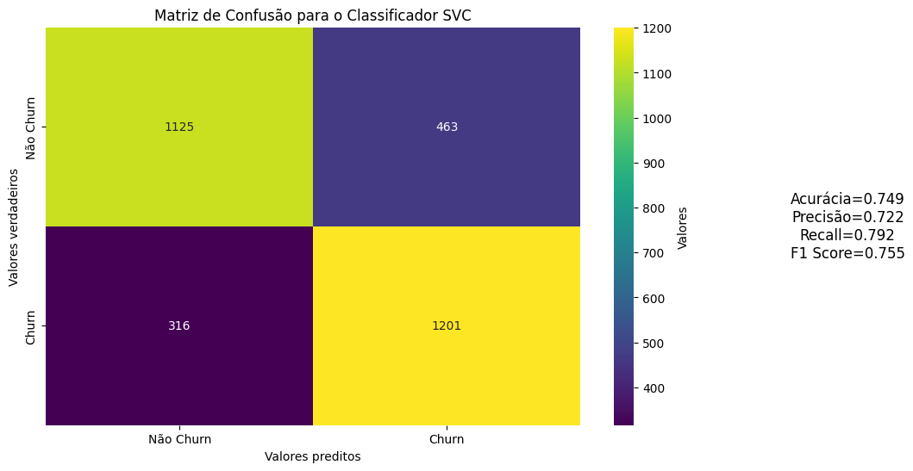
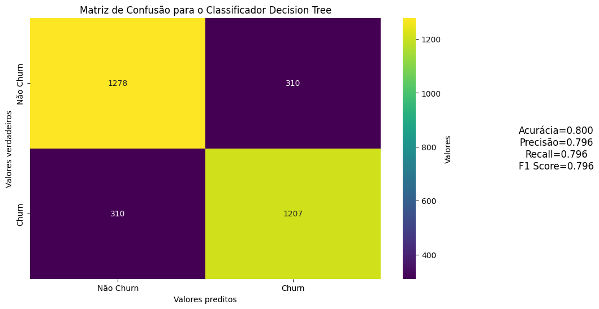
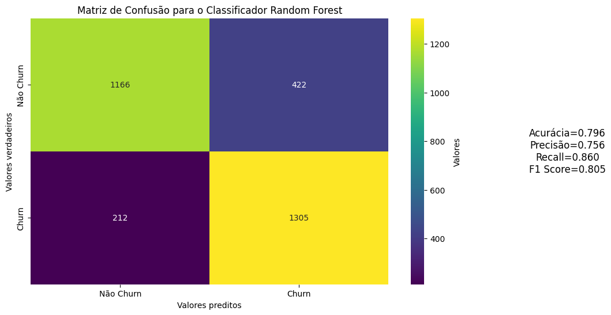

# Previsão de Churn

Este projeto visa desenvolver um modelo de machine learning para prever a evasão de clientes (churn), utilizando os algoritmos Random Forest, SVM e Decision Tree. O objetivo é identificar quais clientes estão propensos a deixar a empresa, para que a equipe de vendas possa tomar medidas proativas.

## Dados

Os dados que utilizei no projeto foram disponibilizados via API em formato JSON, contendo informações sobre clientes, serviços e contratos. Abaixo estão algumas das colunas presentes na base de dados:

### Cliente:
- `gender`: gênero (masculino ou feminino)
- `SeniorCitizen`: se o cliente tem 65 anos ou mais
- `Partner`: se o cliente tem um parceiro/parceira
- `Dependents`: se o cliente tem dependentes

### Serviço de telefonia:
- `tenure`: meses de contrato do cliente
- `PhoneService`: assinatura de serviço telefônico
- `MultipleLines`: assinatura de mais de uma linha de telefone

### Serviço de internet:
- `InternetService`: assinatura de um provedor de internet
- `OnlineSecurity`: assinatura adicional de segurança online
- `OnlineBackup`: assinatura adicional de backup online
- `DeviceProtection`: assinatura adicional de proteção no dispositivo
- `TechSupport`: assinatura adicional de suporte técnico
- `StreamingTV`: assinatura de TV a cabo
- `StreamingMovies`: assinatura de streaming de filmes

### Contrato:
- `Contract`: tipo de contrato
- `PaperlessBilling`: se o cliente prefere receber fatura online
- `PaymentMethod`: forma de pagamento
- `Charges.Monthly`: total de todos os serviços do cliente por mês
- `Charges.Total`: total gasto pelo cliente

## Desenvolvimento do Projeto

### Entendimento dos Dados

Realizei o entendimento da base de dados e do dicionário de dados fornecidos. Analisei a estrutura do JSON e identifiquei as colunas relevantes para o projeto.

O notebook pode ser encontrado [aqui](Limpeza.ipynb).

### Análise dos Dados

Foquei na análise exploratória dos dados. Gerei gráficos de distribuição, boxplots para detecção de outliers e uma matriz de correlação para entender melhor as relações entre as variáveis.

O notebook pode ser encontrado [aqui](analise.ipynb).

### Modelos de Machine Learning

Desenvolvi três modelos de machine learning: SVM, Decision Tree e Random Forest. Treinei e avaliei cada modelo para determinar o mais adequado para prever o churn.

O notebook pode ser encontrado [aqui](treinamento.ipynb).

### Otimização do Modelo

Foquei na otimização do modelo Random Forest, que apresentou os melhores resultados. Utilizei GridSearchCV para ajustar os hiperparâmetros e melhorar a performance do modelo.

O notebook pode ser encontrado [aqui](otimizacao.ipynb).

## Resultados

### Desempenho dos Modelos

| Modelo         | Acurácia (Treino) | Acurácia (Teste) | Precisão | Recall | F1 Score |
|----------------|-------------------|------------------|----------|--------|----------|
| SVM            | 0.751             | 0.749            | 0.721    | 0.791  | 0.755    |
| Decision Tree  | 0.809             | 0.800            | 0.795    | 0.795  | 0.795    |
| Random Forest  | 0.818             | 0.795            | 0.755    | 0.860  | 0.804    |

### Otimização do Random Forest

Após a otimização, o modelo Random Forest apresentou os seguintes resultados:

- **Acurácia (Teste):** 0.872
- **Precisão:** 0.841
- **Recall:** 0.828
- **F1 Score:** 0.834

### Matrizes de Confusão

#### SVM

#### Decision Tree

#### Random Forest

## Conclusão

O modelo Random Forest, após otimização, se mostrou o mais eficaz para prever a evasão de clientes. Com este modelo, a equipe de vendas pode identificar clientes propensos a churn e agir proativamente para reter esses clientes.

## Requisitos

- Python 3.x
- Pandas
- Seaborn
- Matplotlib
- Scikit-learn
- Imbalanced-learn

## Instruções de Uso

1. Clone este repositório.
2. Instale os pacotes necessários utilizando `pip install -r requirements.txt`.
3. Execute os notebooks em ordem para reproduzir os resultados.

## Contato

Para mais informações, entre em contato comigo, [Gabriel Marcolino](mailto:gabrielmarcolinoramosbh@gmail.com).
